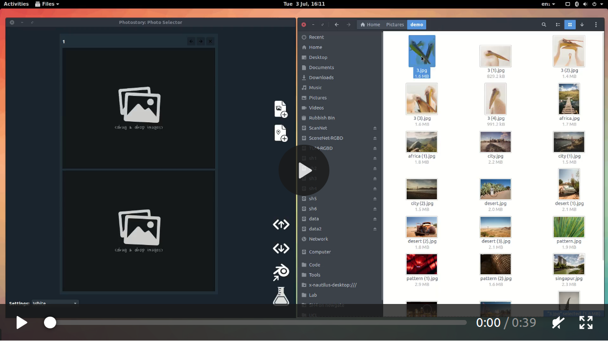
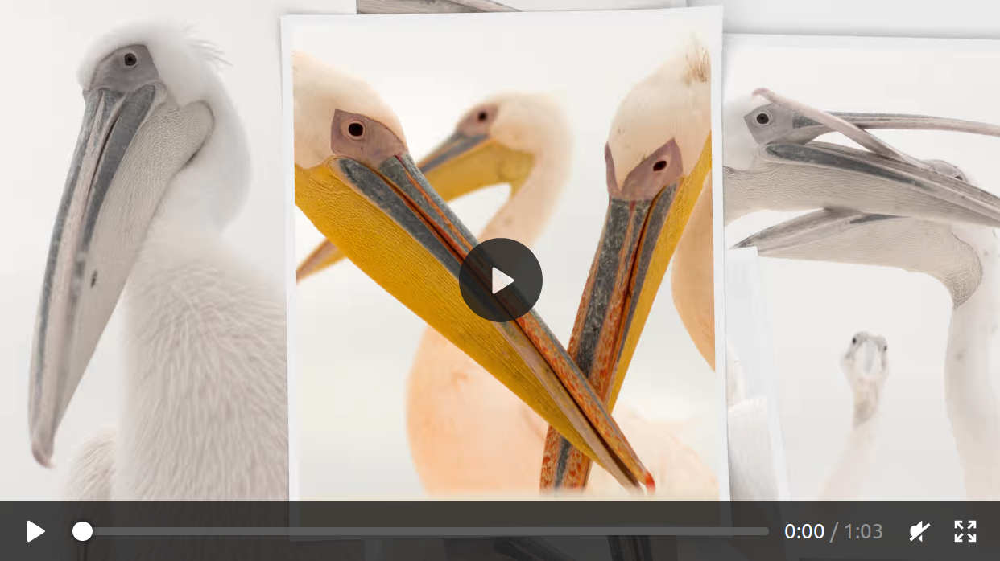

  # photostory


**Photostory** is a tool to generate slideshows using [Blender](http://www.blender.org). It can generate videos directly, but also offers a workflow for more customization.


## Install

#### 1. Install dependencies

* Install [Blender](https://blender.org) and make sure that the command `blender` can be executed in your terminal
* Install Qt >= 5.9
* **Optionally**, use *ffmpegthumbnailer*, which is used to show video thumbnails within the *photo-selector* application:
```
mkdir -p photo-selector/third_party
cd photo-selector/third_party
git clone --depth=1 https://github.com/dirkvdb/ffmpegthumbnailer.git
cd ffmpegthumbnailer
mkdir build
cd build
cmake ..
make -j5
```

#### 2. Build photo-selector

```
cd photo-selector
mkdir build
cd build
cmake ..
# Use something like this instead, if you have a local Qt installation: cmake -DQt5_DIR=/usr/lib/x86_64-linux-gnu/cmake/Qt5 ..
make -j4
```

#### 3. Download assets
This will download a texture and height-map of the world for rendering maps.
```
./download_assets.sh
```

#### 4. Enable io_photostory addon in Blender

* Either copy the directory *io_photostory* into the blender addons directory, or create a symbolic link, like: `ln -s io_photostory /path/to/blender/2.79/scripts/addons/`
* Enable the addon in the Blender settings, as [described here](https://docs.blender.org/manual/en/dev/preferences/addons.html).


## Usage

#### Automatic workflow

The automatic workflow hides details of the manual process away, but obviously gives you fewer settings to adjust. The following video shows how to arrange slides using the `photo-selector`:

[](https://www.martinruenz.de/media/photostory/photo-selector.mp4)

And here is the result after rendering:

[](https://www.martinruenz.de/media/photostory/demo.webm)

***At this stage, it is recommended to store and import the JSON file manually.***

#### Manual workflow

Instead of rendering the video directly from the GUI it is possible to save the JSON exchange format in order to import it into Blender manually. The resulting file describes slides like this:

```JSON
{
    "type": "photo_slide",
    "name": "3",
    "background_paths": [],
    "foreground_paths": [
        "joshua-earle-560344-unsplash.jpg",
        "kea-mowat-574639-unsplash.jpg",
        "pascal-debrunner-634122-unsplash.jpg"
    ]
}
```

In Blender load the slideshow via **File ➜ Import ➜ Photostory (.json)**. This importer gives you the options:

* **Unroll map**: If set, adds an unrolling map animation to the beginning of the scene (see example).
* **Skip duplicates**: If set, placeholder images for duplicate frames are created in the output directory (this directory needs to be specified in Blender before importing). This will speed up the rendering process significantly as long as the **overwrite** flag in Blender is not set. After rendering, placeholders need to be replaced using the script </br> **photo-selector/generate_duplicates.py**, which replaces empty image files with the previous non-empty image.
* **Setup scene**: If set, scene properties such as start and end frame are adjusted as well.
* **Default slide duration**: Default duration of slides (might be overwritten by JSON).


Now you have the opportunity to customize the slideshow in 3D using Blender. The generated scene should work with the internal as well as Cycles renderer. Rendering is done usual, only make sure not to change the output directory if you generated placeholders with be setting *skip duplicates*.

## Todos / Ideas

#### General / JSON:

* Music
* Transition (Variations), even though this will increase rendering time by a lot
* Text slides
* Write down JSON schema
* More (hand-crafted?) layouts
* Read GPS from EXIF meta data

#### photo-selector:

* Show progress when rendering / opening Blender
* Widget to select GPS locations with OSM
